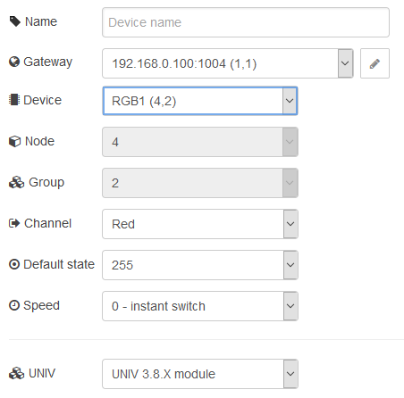
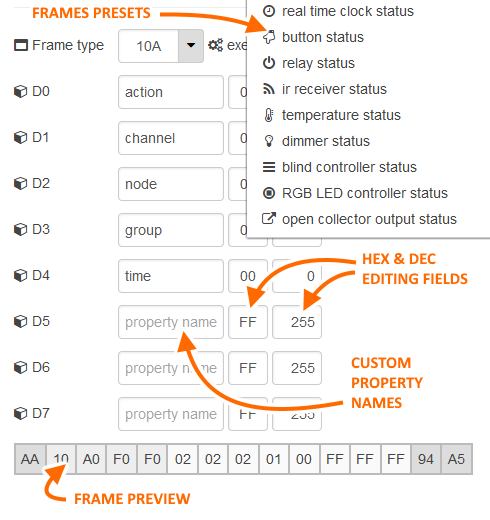
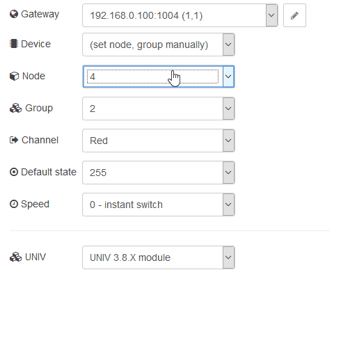

# node-red-contrib-hapcan

## Description

The node.js package that brings [HAPCAN](http://hapcan.com/) Home Automation Project support in node-red.

Nodes are using the [Hapcan ethernet module](http://hapcan.com/devices/universal/univ_3/univ_3-102-0-x/index.htm) to communicate between Hapcan bus and node-red.

## Hardware requirements

- Hapcan based infrastructure
- Hapcan ethernet module

# Instalation
## Using NODE-RED installer

Just open **Manage palette** from node-red dashboard menu, switch to **Install** tab and search for *hapcan* word. Only stable releases.
## Using npm

Only stable releases

```npm install node-red-contrib-hapcan```

## Using github

Latest available version - working in most cases.

```git clone https://github.com/Onixarts/node-red-contrib-hapcan```

# What You get in the package?

Package contains multiple input and output nodes for different Hapcan modules. You don't need to know any Hapcan's messages to make it work. 
Each node uses special (hidden) gateway node to communicate with Hapcan system. UNIV3 and UNIV1 modules support included.

## Currently available nodes:

- **Blind input** receives messages from [blind controller](https://hapcan.com/devices/universal/univ_3/univ_3-7-0-x/index.htm)
- **Blind output** allows controlling the [blind controller](https://hapcan.com/devices/universal/univ_3/univ_3-7-0-x/index.htm)
- **Button input** receives messages from [button modules](https://hapcan.com/devices/universal/univ_3/univ_3-1-x-x.htm)
- **Button output** allows controlling button LEDs [button modules](https://hapcan.com/devices/universal/univ_3/univ_3-1-3-x.htm)
- **Dimmer input** receives messages from [dimmer module](https://hapcan.com/devices/universal/univ_3/univ_3-6-0-x/index.htm)
- **Dimmer output** allows controlling [dimmer module](https://hapcan.com/devices/universal/univ_3/univ_3-6-0-x/index.htm)
- **IR input** receive infrared sensor messages from [Infrared receiver and transmitter](https://hapcan.com/devices/universal/univ_3/univ_3-5-0-x/index.htm)
- **Relay input** receives messages from [relay modules](https://hapcan.com/devices/universal/univ_3/univ_3-2-x-x.htm)
- **Relay output** allows controlling the [relay modules](https://hapcan.com/devices/universal/univ_3/univ_3-2-x-x.htm)
- **RGB input** receives messages from [RGB LED controller module](https://hapcan.com/devices/universal/univ_3/univ_3-8-0-x/index.htm)
- **RGB output** allows controlling [RGB LED controller module](https://hapcan.com/devices/universal/univ_3/univ_3-8-0-x/index.htm)
- **RTC input** receives time messages from [ethernet module](https://hapcan.com/devices/universal/univ_3/univ_3-102-0-x/index.htm)
- **RTC output** allows set time and date for [ethernet module](https://hapcan.com/devices/universal/univ_3/univ_3-102-0-x/index.htm)
- **State output** helps request Hapcan modules status informations
- **Temp input** receives temperature messages from [button modules](https://hapcan.com/devices/universal/univ_3/univ_3-4-x-x.htm)
- **Thermostat input** receives thermostat messages from [button modules](https://hapcan.com/devices/universal/univ_3/univ_3-1-3-x/index.htm)
- **Custom input** receives any Hapcan's frame data from any module (custom modules included).
- **Custom output** sends any configured (static) and dynamic (payload) message to Hapcan's bus.
- **Open Collector input** receives messages from [open collector outputs module](https://hapcan.com/devices/universal/univ_3/univ_3-9-0-x/index.htm)
- **Open Collector output** allows controlling the [open collector outputs module](https://hapcan.com/devices/universal/univ_3/univ_3-9-0-x/index.htm)

# Usage

Simply drag any Hapcan node and double click to open edit mode. First, You need to configure gateway. You need to do it only once. Any other node will use this gateway.


Each node has help provided, so You can read about parameters and its possibilities.

You can configure each input node to receive data from selected node, but You can also filter the messages if this node has many inputs (for example 14 buttons module).

**Input nodes** produces json object payload that contains simply to understand Hapcan message values that You can use in Your flow. There are also **userField** value available, so it is possible to output custom defined value on each input state.

**Output nodes** delivers default action, that You can choose for the selected Hapcan module (for example toggle action in relay output), so any payload received by this node will trigger the default action.
You can also control Hapcan module by passing more detailed payload with **topic** set to **control** value. Details are available in the help panel for each node.

You can control the nodes by payload in many ways. For example, let's consider relay output. You can pass string value with "ON", "Off", "Toggle" text (case insensitive) to switch channel selected in node configuration. You can also pass number 0,1,2 (Hapcan module compatible values). You can also pass bool value of true or false, to enable or disable relay - in this case the possible actions are limited to ON and OFF.
Finally, you can pass object (JSON) where You have full control over node - You can override default settings in configuration then.

Example of RGB output node configuration - it contains each control frame fields for simple use.



Thera are also Custom input and output nodes which allows You to send and receive any messages to and from the bus. You can name each data byte as You want. It also has a preset menu, with common Hapcan's messages frames, ready to be used.



**Discover devices** function allows You to search the Hapcan bus for devices present, and then select them easily in any node configuration instead remember necessity for node and group number for each device.

